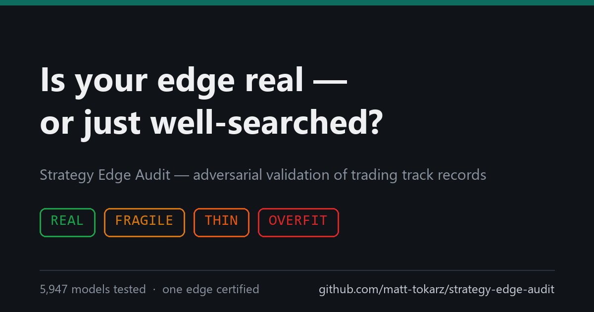

# Strategy Edge Audit

**Is your edge real — or just well-searched?**

Adversarial statistical validation of trading track records:
Deflated Sharpe at adversarial trial counts · five-tier cost stress ·
selection-bias screens. Verdict: **REAL / FRAGILE / THIN / OVERFIT**.

**[Landing page](https://matt-tokarz.github.io/strategy-edge-audit/)** ·
**[Sample report](sample-audit-report.md)** ·
**[Book a 15-min scoping call](mailto:strategyedge@proton.me?subject=Edge%20Audit%20—%20scoping%20call)**

---

# We trained 5,947 models and pre-registered 192 hypotheses. One edge survived.

*What eight months of adversarial validation taught us about backtests — and why
your best-looking strategy is probably your worst.*

## The number that should scare you

In May 2026 our platform carried 28 "validated" model deployments — each pinned
to a backtest that had demonstrated positive, cost-adjusted returns. Twenty of
those had one thing in common: our Deflated Sharpe gate had flagged them
(`dsr_pass=false`), and they had been deployed anyway.

Within five days of forward trading, the model with the **highest** backtest
Sharpe in the fleet (4.85) produced the **worst** forward result: **−10.4%**.
Across the batch, backtest Sharpe was *anti-correlated* with forward P&L.

That is not bad luck. That is selection bias doing exactly what it always does:
the more configurations you test, the more your "best backtest" measures your
search effort instead of the market.

## What we actually ran

Over eight months, on our own capital-gated research platform:

- **5,947 trained model versions** (6 model families × symbols × timeframes ×
  feature sets × label schemes), each evaluated out-of-fold;
- **~192 pre-registered statistical experiments** — hypothesis, cells, and
  kill-criteria frozen *before* looking at results (liquidation cascades,
  funding contrarian trades, cross-sectional long/short, short-horizon
  order-flow, execution simulations, carry overlays);
- a **validation harness** applied uniformly: Deflated Sharpe Ratio with
  program-level trial counting, five-tier cost stress (10+2 → 30+10 bps
  round-trip), walk-forward fold stability, out-of-sample threshold splits,
  and overfit detectors (derivation-vs-holdout deltas, thin-tail Sharpe,
  calendar-window smells).

The result:

| Category | Attempts | Survivors |
|---|---:|---:|
| Directional ML models (crypto + US equities) | ~5,700 trainings, 0/2,352 DSR cells in the final honest re-run | **0** |
| Pre-registered microstructure/flow hypotheses | ~192 | **1 live lead** (execution-gated, still measuring) |
| Market-neutral carry / basis family | 12+ variants | **1 certified edge** |

The certified survivor is a delta-neutral funding-rate strategy: Sharpe ~5.8 in
a five-year backtest, **positive in every calendar year 2021–2026**, and robust
to the full cost-stress sweep. It is boring, capacity-limited, and real.

## The failure modes we caught (in our own work)

**1. The multiple-testing mirage.** A pooled 5-symbol model showed per-symbol
AUC of 0.63–0.68 on 400k out-of-sample bars — genuinely informative
predictions. The naive gate picked an operating threshold on the full sample:
Sharpe 10.9. The honest protocol (pick threshold on the first 70%, measure on
the held-out 30%) delivered **11 trades** and a Deflated Sharpe probability of
0.345. Verdict: unvalidatable. An informative model is not a tradeable one.

**2. Cost blindness.** Short-horizon signals were our strongest predictions
(out-of-sample IC of +0.147 at 10 seconds, consistent across 11 of 11 symbols).
Execution simulation killed them all: −10 to −21 bps per round trip after
adverse selection. The signal is real; the business is not — unless your fee
tier or infrastructure changes.

**3. Calendar-window overfitting.** The 20 bad pins above shared another
signature: weekend-only or weekday-only trading windows on 24/7 crypto markets,
discovered by a parameter sweep. A day-of-week filter on an always-open market
is almost never an edge. It is almost always the sweep fitting noise.

**4. The picker fits the slice it picks on.** Every threshold, session window,
or hyperparameter chosen on the same data that "validates" it inflates the
result. Our fix is structural: derivation and validation slices are disjoint
by construction, and the gate refuses to certify anything else.

## Why we're publishing this

Because the harness is the asset. Every strategy pitch an allocator receives
has survived the *sender's* selection process — which means its backtest is,
by construction, an upper bound. The only defensible response is adversarial
validation: deflate for trials, stress for costs, split for selection,
and demand a minimum evidence base before believing anything.

We built that harness for ourselves, pointed it at our own work, and it
killed nearly everything — including the models we most wanted to believe in.
Then it certified one strategy, and that one has made money in every year of
its evaluation window. A gate that only says "no" is a cynicism generator;
a gate that says "no" 191 times and "yes" once is an instrument.

## Strategy Edge Audit

We now run the same protocol on external strategies. You provide a trade
series (timestamps, sides, sizes, fills — **not** your logic or code); we
return a verdict:

1. **Deflated Sharpe** at your declared trial count — and at stress-tested
   trial counts, because everyone under-reports how much they searched;
2. **Five-tier cost stress**: at what fee/slippage level does the edge die;
3. **Walk-forward / fold stability**: does the edge live in one regime or all;
4. **Selection-bias screens**: in-sample threshold picks, calendar windows,
   thin-tail Sharpe, derivation-vs-holdout deltas;
5. Classification: **REAL / FRAGILE / THIN / OVERFIT**, with the minimum
   additional evidence needed to upgrade.

A statistical assessment of historical trading records. Not investment advice,
not a performance guarantee, and deliberately incapable of flattery.

**Sample report** — an audit of our *own* strategy, verdict THIN:
[sample-audit-report.md](./sample-audit-report.md)

---

*Contact: **matt-tokarz** · strategyedge@proton.me*
